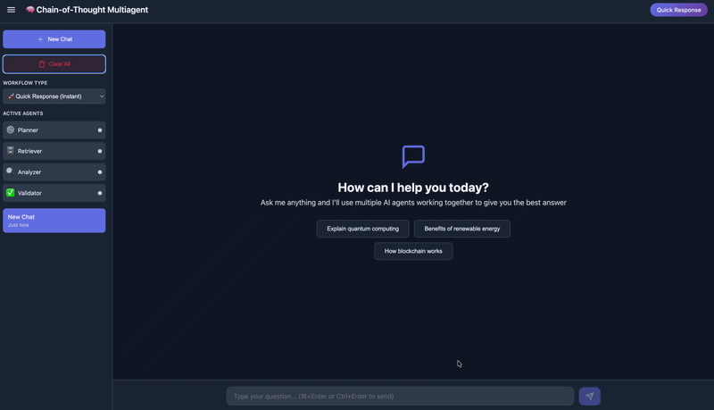

# Bedrock Agent Core - Project Structure

**Last Updated**: February 13, 2026
**Status**: Production-Ready

---



---

## 📁 Project Overview

This project contains a deployed AWS Bedrock Agent Core multi-agent system with a TypeScript Lambda proxy for API Gateway integration and a frontend web application.

```
bedrock-agent-core/
├── 📄 IMPLEMENTATION.md              # Complete implementation documentation
├── 📄 PROJECT_STRUCTURE.md           # This file - project organization
├── 📄 .bedrock_agentcore.yaml        # Agent deployment configuration
├── 📄 requirements.txt                # Python dependencies for agent
├── 📄 multiagent_example.py          # Multi-agent implementation (deployed)
│
├── 📁 lambda_node/                    # TypeScript Lambda (PRODUCTION - DEPLOYED)
│   ├── index.ts                       # Lambda handler source code
│   ├── package.json                   # Node.js dependencies
│   ├── tsconfig.json                  # TypeScript configuration
│   ├── lambda_deployment_node.zip     # Deployment package (7.7MB)
│   ├── dist/                          # Compiled JavaScript
│   └── node_modules/                  # Dependencies (@aws-sdk/client-bedrock-agentcore)
│
├── 📁 static/                         # Frontend web application
│   ├── index.html                     # Main UI
│   ├── app.js                         # Frontend logic (connects to API Gateway)
│   └── styles.css                     # Styling
│
├── 📁 venv/                           # Python virtual environment (for local agent development)
│
└── 📁 .bedrock_agentcore/             # Agent Core deployment metadata
    └── ...                            # Build artifacts and deployment state

```

---

## 🎯 Production Components

### 1. **Deployed Agent** (`multiagent_example.py`)

**Purpose**: Multi-agent orchestration system deployed to AWS Bedrock Agent Core

**Components**:
- **Planner Agent**: Analyzes requests and plans workflow
- **Retriever Agent**: Fetches relevant information
- **Analyzer Agent**: Processes and analyzes data
- **Validator Agent**: Validates results and ensures quality

**Deployment**:
- **ARN**: `arn:aws:bedrock-agentcore:ap-northeast-1:YOUR_ACCOUNT_ID:runtime/YOUR_AGENT_ID`
- **Region**: `ap-northeast-1`
- **Runtime**: Containerized Python agent

---

### 2. **Lambda Function** (`lambda_node/`)

**Purpose**: Proxy between API Gateway and Bedrock Agent Core Runtime

**Implementation**: TypeScript with AWS SDK v3
- Package: `@aws-sdk/client-bedrock-agentcore`
- Runtime: Node.js 22.x (arm64)
- Handler: `index.handler`
- Size: 7.7MB

**Key Features**:
- AWS SigV4 authentication (handled by SDK)
- Streaming response collection
- SSE format pass-through
- CORS enabled
- Session management (33+ character session IDs)

**Deployed To**:
- **Function**: `BedrockAgentCoreProxy`
- **Region**: `ap-northeast-1`
- **Timeout**: 300 seconds
- **Memory**: 256 MB

---

### 3. **API Gateway**

**Purpose**: REST API endpoint for frontend access

**Configuration**:
- **API Name**: BedrockAgentCoreGateway
- **API ID**: `YOUR_API_GW_ID`
- **Type**: REST API (Regional)
- **Endpoint**: `https://YOUR_API_GW_ID.execute-api.YOUR_REGION.amazonaws.com/prod/invocations`

**Methods**:
- `POST /invocations` → Lambda proxy integration
- `OPTIONS /invocations` → CORS preflight

---

### 4. **Frontend** (`static/`)

**Purpose**: Web-based UI for interacting with the deployed agent

**Files**:
- `index.html` - Main UI with chat interface
- `app.js` - JavaScript logic, SSE parsing, workflow selection
- `styles.css` - UI styling

**Configuration**:
- API URL: Points to API Gateway endpoint
- Supports two workflows:
  - `chain-of-thought`: Multi-agent orchestration (4 phases)
  - `quick-response`: Direct final response

**Features**:
- Real-time streaming responses
- Agent phase visualization
- Conversation history
- Workflow selection

---

## 🔧 Development Components

### Python Virtual Environment (`venv/`)

Used for local agent development and testing.

**Activate**:
```bash
source venv/bin/activate
```

**Install Dependencies**:
```bash
pip install -r requirements.txt
```

---

## 📋 Configuration Files

### `.bedrock_agentcore.yaml`

Agent deployment configuration containing:
- Agent names and entrypoints
- AWS account and region settings
- ECR repository URLs
- IAM roles
- Network configuration
- Memory settings

**Key Agents Defined**:
1. `strand_multiagent` (older version)
2. `multiagent_example` (current production agent)

### `requirements.txt`

Python dependencies for the agent:
```
strands>=0.0.85
bedrock_agentcore>=0.0.4
pydantic>=2.0.0
```

---

## 🚀 Deployment Commands

### Deploy Agent (to Bedrock Agent Core)

```bash
# Activate venv
source venv/bin/activate

# Deploy agent
agentcore deploy
```

### Deploy Lambda (TypeScript)

```bash
cd lambda_node

# Build TypeScript
npm run build

# Create deployment package
rm -f lambda_deployment_node.zip
cp -r node_modules dist/
cd dist && zip -r ../lambda_deployment_node.zip .

# Deploy to AWS
aws lambda update-function-code \
  --function-name BedrockAgentCoreProxy \
  --zip-file fileb://lambda_deployment_node.zip \
  --region ap-northeast-1
```

---

## 🧪 Testing

### Test API Gateway Endpoint

```bash
curl -X POST https://YOUR_API_GW_ID.execute-api.YOUR_REGION.amazonaws.com/prod/invocations \
  -H "Content-Type: application/json" \
  -d '{"prompt": "Hello", "workflow": "quick-response"}' \
  --no-buffer
```

### Test Frontend Locally

```bash
cd static
python3 -m http.server 8080
# Open http://localhost:8080
```

### View Lambda Logs

```bash
aws logs tail /aws/lambda/BedrockAgentCoreProxy \
  --since 10m \
  --region ap-northeast-1 \
  --format short
```

---

## 📊 Architecture

```
┌─────────────┐
│   Browser   │
│  (Frontend) │
└──────┬──────┘
       │ HTTPS
       ↓
┌─────────────────────┐
│   API Gateway       │  https://YOUR_API_GW_ID.execute-api...
│  (REST API - prod)  │
└──────┬──────────────┘
       │ Lambda Proxy Integration
       ↓
┌─────────────────────┐
│   Lambda Function   │  BedrockAgentCoreProxy
│   (Node.js 22.x)    │  - Handles AWS authentication
│   index.handler     │  - Streams responses
└──────┬──────────────┘
       │ AWS SDK (@aws-sdk/client-bedrock-agentcore)
       ↓
┌─────────────────────┐
│ Bedrock Agent Core  │  arn:aws:bedrock-agentcore:...
│   Runtime Service   │
│                     │
│  Multi-Agent Flow:  │
│  1. Planner         │
│  2. Retriever       │
│  3. Analyzer        │
│  4. Validator       │
└─────────────────────┘
```

---

## 📝 Key Files Summary

| File | Purpose | Status |
|------|---------|--------|
| `multiagent_example.py` | Agent implementation | ✅ Deployed |
| `lambda_node/index.ts` | Lambda proxy handler | ✅ Deployed |
| `static/app.js` | Frontend application | ✅ Active |
| `IMPLEMENTATION.md` | Full documentation | 📖 Reference |
| `.bedrock_agentcore.yaml` | Agent config | ⚙️ Config |
| `requirements.txt` | Python dependencies | 📦 Dev |

---

## 🔐 AWS Resources

### Lambda Function
- **Name**: BedrockAgentCoreProxy
- **Runtime**: nodejs22.x
- **Handler**: index.handler
- **Role**: LambdaBedrockAgentCoreRole
- **Region**: ap-northeast-1

### IAM Role
- **Name**: LambdaBedrockAgentCoreRole
- **Permissions**:
  - `AWSLambdaBasicExecutionRole` (CloudWatch Logs)
  - `bedrock-agentcore:InvokeAgentRuntime` (inline policy)

### API Gateway
- **Name**: BedrockAgentCoreGateway
- **ID**: YOUR_API_GW_ID
- **Stage**: prod
- **Type**: Regional REST API

### Bedrock Agent Core
- **Agent**: multiagent_example
- **ID**: YOUR_AGENT_ID
- **Runtime ARN**: arn:aws:bedrock-agentcore:ap-northeast-1:YOUR_ACCOUNT_ID:runtime/YOUR_AGENT_ID

---

## 💡 Development Workflow

### 1. Modify Agent Logic
```bash
# Edit multiagent_example.py
vi multiagent_example.py

# Test locally (if supported)
source venv/bin/activate
python multiagent_example.py

# Deploy to Bedrock Agent Core
agentcore deploy
```

### 2. Modify Lambda
```bash
cd lambda_node

# Edit TypeScript code
vi index.ts

# Build and deploy
npm run build
# ... (deployment commands above)
```

### 3. Modify Frontend
```bash
cd static

# Edit frontend files
vi app.js

# No build step needed - just refresh browser
```

---

## 🎓 Learning Resources

- **IMPLEMENTATION.md**: Complete walkthrough of the implementation
- **AWS Bedrock Agent Core Docs**: https://docs.aws.amazon.com/bedrock-agentcore/
- **AWS SDK for JavaScript v3**: https://docs.aws.amazon.com/AWSJavaScriptSDK/v3/

---

## 📈 Cost Estimate

**Monthly Cost** (based on 1M requests):
- API Gateway: ~$4.40
- Lambda: ~$6.87
- Bedrock Agent Core: Variable (token-based)
- **Total Infrastructure**: ~$11-15/month

**With AWS Free Tier** (first 12 months):
- Lambda: $0 (within free tier)
- **Total**: ~$4.40/month

---

## ✅ Production Checklist

- ✅ Agent deployed to Bedrock Agent Core
- ✅ Lambda function deployed and tested
- ✅ API Gateway configured with CORS
- ✅ Frontend connected to API Gateway
- ✅ IAM permissions configured
- ✅ Streaming responses working
- ✅ Error handling implemented
- ✅ CloudWatch logging enabled

