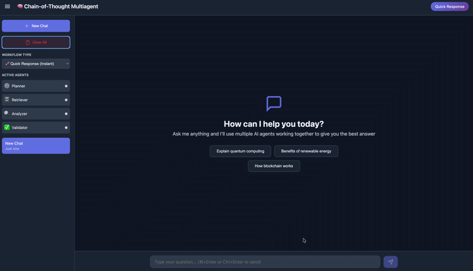

# Bedrock AgentCore — Multi-Agent Orchestration System

A production-deployed multi-agent AI system built on **AWS Bedrock AgentCore** and the **Strands** framework. Rather than routing everything through a single LLM call, this project splits complex tasks across four specialised agents — each owning one stage of the pipeline — making responses more reliable, failures easier to debug, and the overall system easier to extend.

> Built in February 2026 on AgentCore and Strands, both newly released AWS services with minimal documentation at the time. Most patterns here were figured out from SDK source code and first-party AWS examples.

---



*Chain-of-thought mode — watch each agent phase complete in real time via streaming responses.*

---

## Why this exists

Single-agent LLM systems struggle with tasks that require planning, retrieval, analysis, and validation in sequence. Putting all of that into one agent produces inconsistent results and makes it hard to know where a failure occurred.

This project explores a structured alternative: four agents, each with a single responsibility, executing in a defined order. The result is more predictable behaviour and a clear audit trail of what each stage produced.

---

## How it works

```
Browser
   │
   ▼
API Gateway  (REST — regional)
   │
   ▼
Lambda Proxy  (TypeScript / Node.js 22.x)
   │  SigV4 auth · SSE streaming · session management
   ▼
Bedrock AgentCore Runtime
   │
   ├── 1. Planner    — breaks the request into a structured execution plan
   ├── 2. Retriever  — fetches relevant information based on the plan
   ├── 3. Analyzer   — synthesises and processes retrieved information
   └── 4. Validator  — checks output quality before returning to the user
```

Two workflow modes are supported:

- **Chain-of-thought** — runs all four agents, shows intermediate steps as they stream in
- **Quick-response** — skips intermediate phases, returns the final answer directly

---

## Architecture decisions

**Why four agents instead of one?**
Each agent has a single, well-defined job. If the output is wrong you can trace exactly which stage broke. Each agent can also be prompted and tuned independently without affecting the others. The Planner → Retriever → Analyzer → Validator pattern mirrors how a human expert approaches a complex research task.

**Why AgentCore over standard Bedrock Agents?**
Bedrock Agents use a ReAct loop — plan, act, observe, repeat — which adds latency and non-determinism. AgentCore gives direct control over the agent runtime and execution lifecycle, making it better suited to structured pipelines where you need predictable, sequential behaviour.

**Why Strands?**
Strands is AWS's open-source agent framework with first-party AgentCore support. At the time of building this it was the only framework that made AgentCore deployment straightforward, handling the containerisation, ECR push, and runtime registration that would otherwise require significant boilerplate.

---

## Tech stack

| Layer | Technology |
|---|---|
| Agent framework | Strands + AWS Bedrock AgentCore |
| Lambda proxy | TypeScript, Node.js 22.x (arm64), AWS SDK v3 |
| API layer | Amazon API Gateway — REST, Regional |
| Frontend | Vanilla JS, HTML, CSS — SSE streaming |
| Auth | AWS SigV4 via SDK |
| Observability | CloudWatch Logs |

---

## Project structure

```
├── multiagent_example.py        # Core agent — Strands + AgentCore (deployed)
├── requirements.txt             # Python dependencies
├── .bedrock_agentcore.yaml      # AgentCore deployment config
│
├── lambda_node/
│   ├── index.ts                 # Lambda handler — proxies to AgentCore, streams responses
│   ├── package.json
│   └── tsconfig.json
│
└── static/
    ├── index.html               # Chat UI
    ├── app.js                   # SSE parsing, workflow selection, streaming logic
    └── styles.css
```

---

## Getting started

### Prerequisites

- AWS account with Bedrock AgentCore access enabled
- Python 3.11+ and Node.js 22+
- AWS CLI configured with appropriate IAM permissions
- AgentCore CLI: `pip install bedrock-agentcore`

### 1. Set up Python environment

```bash
git clone https://github.com/imran-KG/bedrock-agentcore-strand-starter
cd bedrock-agentcore-strand-starter
python -m venv venv
source venv/bin/activate
pip install -r requirements.txt
```

### 2. Deploy the agent

```bash
agentcore deploy
```

This builds a container image, pushes it to ECR, and registers the agent runtime. Note the agent ARN from the output.

### 3. Deploy the Lambda proxy

```bash
cd lambda_node
npm install
npm run build
rm -f lambda_deployment_node.zip
cp -r node_modules dist/
cd dist && zip -r ../lambda_deployment_node.zip .

aws lambda update-function-code \
  --function-name BedrockAgentCoreProxy \
  --zip-file fileb://lambda_deployment_node.zip \
  --region ap-northeast-1
```

### 4. Run the frontend locally

```bash
cd static
python3 -m http.server 8080
# Open http://localhost:8080
```

Update the API URL in `app.js` to point to your API Gateway endpoint.

### 5. Test the API directly

```bash
curl -X POST https://<your-api-id>.execute-api.<region>.amazonaws.com/prod/invocations \
  -H "Content-Type: application/json" \
  -d '{"prompt": "Hello", "workflow": "quick-response"}' \
  --no-buffer
```

---

## Key implementation notes

**Session management** — AgentCore requires session IDs of 33+ characters. Sessions preserve conversation context across multiple turns without any external state store.

**Streaming** — the Lambda proxy collects SSE chunks from AgentCore and passes them through to the frontend incrementally. Lambda timeout is set to 300s to handle long multi-agent responses without cutting off mid-stream.

**CORS** — API Gateway includes a preflight OPTIONS method so the static frontend can call the API directly from the browser without needing a separate backend server.

**IAM** — the Lambda execution role has a minimal inline policy granting only `bedrock-agentcore:InvokeAgentRuntime`. No wildcard permissions.

---

## What I learned

- AgentCore is lower-level than standard Bedrock Agents — more control, but you manage the agent lifecycle explicitly. Worth it for structured pipelines, overkill for simple Q&A.
- Strands was sparsely documented in early 2026. Most of the deployment patterns here came from reading the SDK source directly, not from official guides.
- Multi-agent systems introduce coordination overhead. The 4-agent split pays off for complex tasks but adds unnecessary latency for simple ones — the quick-response mode exists for exactly this reason.
- Streaming through Lambda requires careful SSE handling. The chunk format coming out of AgentCore differs slightly from standard SSE — the proxy needs to normalise it before the browser can parse it reliably.
- AgentCore cold starts are longer than standard Lambda cold starts due to the container runtime. Session warmup matters in production.

---

## What's next

- [ ] Add a Bedrock Knowledge Base for domain-specific RAG — connect the Retriever agent to a private document store instead of relying on model knowledge
- [ ] Add Bedrock Guardrails for content filtering and PII detection before responses reach the user
- [ ] Add X-Ray tracing across Lambda and AgentCore for end-to-end latency visibility per agent stage
- [ ] Explore replacing API Gateway + Lambda with Bedrock Flows for the orchestration layer — lower latency, less infrastructure

---

## Cost estimate

Based on 1M requests/month:

| Service | Cost |
|---|---|
| API Gateway | ~$4.40 |
| Lambda | ~$6.87 |
| Bedrock AgentCore | Variable — token-based |
| **Total** | **~$11–15/month** |

Within AWS Free Tier (first 12 months): ~$4.40/month

---

## Resources

- [AWS Bedrock AgentCore docs](https://docs.aws.amazon.com/bedrock-agentcore/)
- [Strands framework](https://github.com/strands-agents/sdk-python)
- [AWS SDK for JavaScript v3](https://docs.aws.amazon.com/AWSJavaScriptSDK/v3/)
